## 一、大数据可视化

highcharts网址：https://www.highcharts.com.cn

Highcharts 是一个用纯 JavaScript 编写的一个图表库， 能够很简单便捷的在 Web 网站或是 Web 应用程序添加有交互性的图表，并且免费提供给个人学习、个人网站和非商业用途使用。

 

Highcharts 支持的图表类型有直线图、曲线图、区域图、柱状图、饼状图、散状点图、仪表图、气泡图、瀑布流图等多达 20 种图表，其中很多图表可以集成在同一个图形中形成混合图。


## 二、版本控制器git

很多人都知道，Linus在1991年创建了开源的Linux，从此，Linux系统不断发展，已经成为最大的服务器系统软件了。

Linus虽然创建了Linux，但Linux的壮大是靠全世界热心的志愿者参与的，这么多人在世界各地为Linux编写代码，那Linux的代码是如何管理的呢？事实是，在2002年以前，世界各地的志愿者把源代码文件通过diff的方式发给Linus，然后由Linus本人通过手工方式合并代码！

因为很多开发者不断的贡献代码，这样代码越来越多了，就有了管理代码的问题了，所以Linus花了两周时间自己用C写了一个分布式版本控制系统，这就是Git！一个月之内，Linux系统的源码已经由Git管理了！牛是怎么定义的呢？大家可以想象一下。

Git迅速成为最流行的分布式版本控制系统，尤其是2008年，GitHub网站上线了，它为开源项目免费提供Git存储，无数开源项目开始迁移至GitHub，后来项目越来越多了，其他系统也就开始支持git了（windows， mac）

我们要使用git就要安装客户端

 

双击进行下一步安装

安装完成，提供了控制台

Git Bash 为linux家族（unix，mac等）使用的

Git CMD 为window使用的

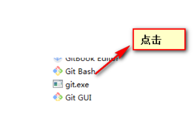 

由于git为linux提供的，所以建议我们使用linux指令

### 2.1 基础命令

1、查看当前的位置 pwd

2、切换目录 cd 

​		windows从c盘进入到d盘 cd  /d 

3、查看当前目录 ls （ls不能查看隐藏文件） ls -a（查看所有文件）

4、要进入该目录： 

​		cd  /D/二十七期/2019年10月20日大数据与git/案例/git 

5、Tab 可以进行自动补全路径

6、创建文件夹 mkdir 文件夹名称

7、创建文件 echo ‘要写入文件的内容’>> 文件名

8、查看文件的内容 cat 文件名

9、之前使用的命令会被记录下来，可以使用上下键进行翻阅

10、查看之前使用过的命令 history

11、清屏 ctrl + l

### 2.2 git的配置

查看配置:git config --list

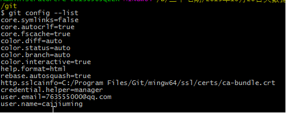 

配置：

```
git config --global user.name “名字”
git config --global user.email “邮箱”
```

### 2.3 初始化

git init 

会产生一个隐藏的文件夹 .git

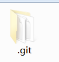 

### 2.4 文件夹说明

objects:工作区文件

refs:版本库文件


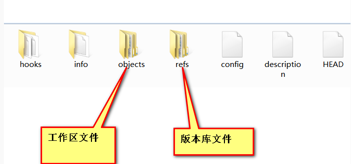 

### 2.5 区域的划分

工作区：该处的文件，还没有被git记录，未跟踪

暂存区：该处的文件，已被git进行记录，已跟踪

版本库：该处的文件，可以进行版本的回退，已记录

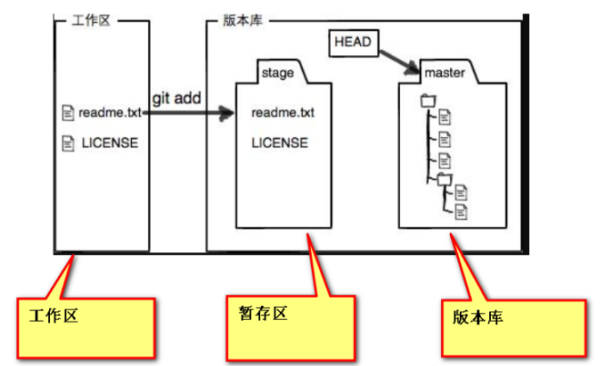 

### 2.6 将文件放入版本库

1、将文件从工作区添加到 暂存区

​	git add 文件名 （多个文件名使用空格分隔， 也可以简写成 git add . 将所有的工作区文件添加到暂存区

2、将暂存区的文件提交到版本库

​	git commit -m ‘提交说明’ 

3、查看当前的状态

​	git status

### 2.7 当文件被修改，查看文件之间的区别

​	git diff 文件名

### 2.8 时间穿梭

回到上一个版本: git reset --hard HEAD^

回到上两个版本: git reset --hard HEAD^^

回到上100个版本: git reset --hard HEAD~100

通用的方法:git reset --hard commit_id

查看commit_id ：

查看日志 git log （局限性，只能查看当前版本以及之前的版本）

查看所有的日志：（用于回到未来） git reflog

回到未来:git reset --hard commit_id

### 2.9 分支

创建分支： git branch 分支名称

切换分支： git checkout 分支名称

创建并切换分支：git checkout -b 分支名称

合并分支: git merge 分支名称

查看合并分支时的矛盾: git diff

删除分支：git branch -d 分支名称

查看分支列表 git branch --list

### 2.10 github

1、注册并登陆到github上面

2、点击设置

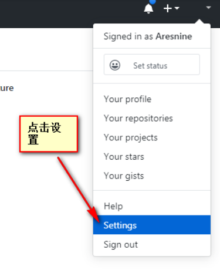 

3、生成秘钥

```
cd ~/.ssh  ~代表的是家目录 
ssh-keygen -t rsa -C "your_email@youremail.com"
然后一路回车
```

4、查看id_rsa.pub文件并复制里面的内容

```
ssh-rsa AAAAB3NzaC1yc2EAAAADAQABAAABAQDfRmQfu63pixZMM2ggyRSJav81ArhwwIyHqrijFRj+P3VpeUEFV9NW3eajQzKXB3yl7b5tClrxbidETP6AG+Fn3DkqQNzhWLtsqp/bBUMQldNkMduWbXeGM8K8TZnJSdwVUSZRrv2HHMhQKnmvTEQbHg7h4LwtQRnZvMJ1yEQJBBdUhwMrFqC6aZK78ZC3nKLXuIC11bDr/OwOcFoWblcNfru3/QaQ6JeO6uZnzGnLWZeTpGs/pDw8j7+bU3I45RrDREVnwKubntC718CdQAHmgAMI++lajo3YDiztpPrX50RL86Yoic9WQMhKgs47Xm6VFk5RWzoab13S4MocqzEf 763555000@qq.com
```

5、将上面的内容复制到github中

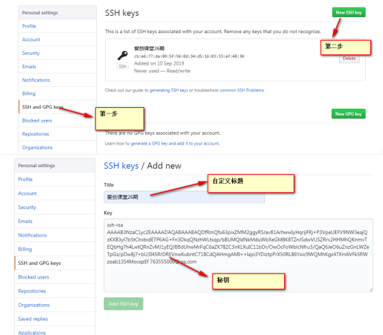 

6、创建一个新的仓库

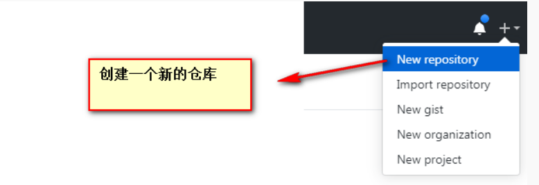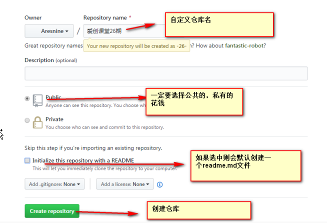  

7、获得仓库的地址

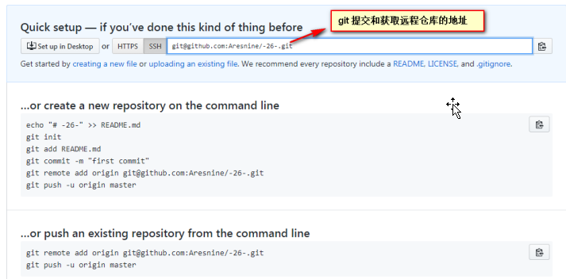 

8、将电脑和远程的仓库进行绑定链接

```
git remote add origin git@github.com:Aresnine/js29.git
```

9、将本地的文件推送到远程仓库

```
git push -u origin master   
origin代表你要推送到远程服务器的那个分支 
master你要推送的分支
```

### 2.11 获取远程仓库文件

获得仓库的地址

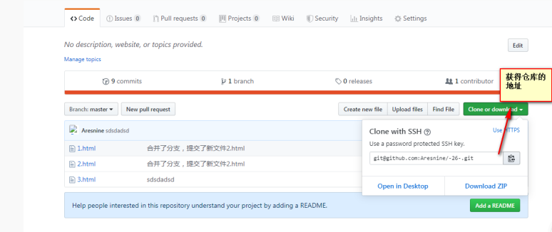

将远程的文件克隆到本地

```
git clone 地址
```

如果远程仓库的文件更新了，想要更新本地文件使用

```
git pull 拉取远程文件 指定分支默认拉取 origin的分支到当前分支
```

### 2.12 预览项目

http://htmlpreview.github.io/